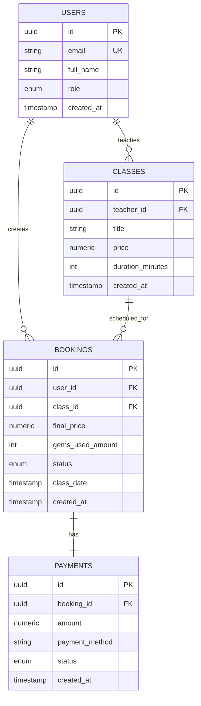

# Supabase MCP Usage Patterns

**Task**: T288
**Purpose**: Common usage patterns and workflows for Supabase MCP
**Audience**: Developers using MCP for database tasks

---

## Overview

This guide provides proven patterns for common database tasks using Supabase MCP. Each pattern includes the natural language prompt, expected AI response, and best practices.

---

## Pattern Categories

1. [Schema Exploration](#schema-exploration)
2. [Query Development](#query-development)
3. [Type Generation](#type-generation)
4. [Migration Creation](#migration-creation)
5. [Data Analysis](#data-analysis)
6. [Debugging](#debugging)
7. [Documentation](#documentation)

---

## Schema Exploration

### Pattern 1: List All Tables

**When**: Need overview of database structure

**Prompt**:
```
Show me all tables in the database
```

**Expected Response**:
```
Here are all tables in your database:

Core Tables:
- users (21 columns)
- profiles (15 columns)

Booking System:
- classes (18 columns)
- bookings (14 columns)

Gem System:
- gem_transactions (10 columns)
- gem_rules (8 columns)

... (20 more tables)

Would you like details on any specific table?
```

**Follow-up**:
```
Tell me more about the bookings table
```

---

### Pattern 2: Understand Table Relationships

**When**: Need to understand how tables connect

**Prompt**:
```
Show me the relationships between users, bookings, and classes tables
```

**Expected Response**:
```
Table Relationships:

users (1) ──< bookings (many)
  - users.id → bookings.user_id (student)

users (1) ──< classes (many)
  - users.id → classes.teacher_id (teacher)

classes (1) ──< bookings (many)
  - classes.id → bookings.class_id

Diagram:
┌─────────┐
│  users  │
└────┬────┘
     │ 1:M
     ├──────> bookings ──> classes
     │          (user_id)   (class_id)
     │
     └──────> classes
                (teacher_id)
```

---

### Pattern 3: Find Tables by Purpose

**When**: Looking for tables related to a feature

**Prompt**:
```
Which tables are related to the gem/cookie system?
```

**Expected Response**:
```
Gem System Tables:

1. gem_transactions
   - Logs all gem earnings and spending
   - Columns: id, user_id, amount, type, source, created_at

2. gem_rules
   - Defines earning rules
   - Columns: id, activity_type, gem_amount, description

3. student_gems (view)
   - Aggregates current balance
   - Columns: user_id, total_earned, total_spent, balance

4. gem_expiration
   - Tracks expiring gems
   - Columns: id, user_id, amount, expires_at

Related Tables:
- bookings (gems_used_amount)
- marketplace_purchases (gem_cost)
```

---

## Query Development

### Pattern 4: Explore Data with Safe Queries

**When**: Need to see sample data

**Prompt**:
```
Show me 5 recent bookings with student and class details
```

**Expected Response**:
```
Here are 5 recent bookings:

| Student    | Class         | Teacher    | Date       | Price  | Gems Used |
|------------|---------------|------------|------------|--------|-----------|
| Alice Lee  | Grammar 101   | Bob Smith  | 2026-02-05 | $15.00 | 50 gems   |
| John Doe   | Conversation  | Jane Wong  | 2026-02-05 | $20.00 | 0 gems    |
... (3 more rows)

Query used:
SELECT
  u.full_name as student,
  c.title as class,
  t.full_name as teacher,
  b.class_date,
  b.final_price,
  b.gems_used_amount
FROM bookings b
JOIN users u ON b.user_id = u.id
JOIN classes c ON b.class_id = c.id
JOIN users t ON c.teacher_id = t.id
ORDER BY b.created_at DESC
LIMIT 5;
```

**Best Practice**: Start with small LIMIT to avoid overwhelming output

---

### Pattern 5: Aggregate Queries

**When**: Need statistics or summaries

**Prompt**:
```
What's the total revenue and average booking price per teacher this month?
```

**Expected Response**:
```
Revenue by Teacher (February 2026):

| Teacher     | Total Bookings | Total Revenue | Avg Price | Gems Discount |
|-------------|----------------|---------------|-----------|---------------|
| Bob Smith   | 45             | $675.00       | $15.00    | $125.00       |
| Jane Wong   | 38             | $760.00       | $20.00    | $90.00        |
... (more rows)

Query:
SELECT
  t.full_name as teacher,
  COUNT(*) as total_bookings,
  SUM(b.final_price) as total_revenue,
  AVG(b.final_price) as avg_price,
  SUM(b.gems_discount_amount) as gems_discount
FROM bookings b
JOIN classes c ON b.class_id = c.id
JOIN users t ON c.teacher_id = t.id
WHERE b.created_at >= DATE_TRUNC('month', NOW())
GROUP BY t.id, t.full_name
ORDER BY total_revenue DESC;
```

---

### Pattern 6: Find Anomalies

**When**: Debugging data issues

**Prompt**:
```
Find bookings where the final_price is less than $5 (our minimum)
```

**Expected Response**:
```
⚠️  Found 3 bookings below minimum price:

| ID  | Student   | Class         | Final Price | Created At |
|-----|-----------|---------------|-------------|------------|
| 123 | Test User | Test Class    | $0.50       | 2026-01-15 |
| 456 | Alice Lee | Grammar       | $4.99       | 2026-01-20 |
| 789 | Bob Test  | Sample Class  | $2.00       | 2026-01-25 |

Possible causes:
- Test data not cleaned up
- Bug in pricing calculation
- Manual price override

Recommendation: Review booking validation logic
```

---

## Type Generation

### Pattern 7: Generate TypeScript Types for a Table

**When**: Building frontend components

**Prompt**:
```
Generate TypeScript types for the bookings table
```

**Expected Response**:
```typescript
// Generated from database schema: bookings

export interface Booking {
  id: string; // UUID
  user_id: string; // UUID
  class_id: string; // UUID
  class_date: Date; // TIMESTAMPTZ
  original_price: number; // NUMERIC(10,2)
  gems_used_amount: number; // INTEGER
  gems_discount_amount: number; // NUMERIC(10,2)
  final_price: number; // NUMERIC(10,2)
  status: 'pending' | 'confirmed' | 'cancelled' | 'completed'; // booking_status enum
  payment_id: string | null; // VARCHAR(255)
  created_at: Date; // TIMESTAMPTZ
  updated_at: Date; // TIMESTAMPTZ
}

// Insert type (omits auto-generated fields)
export type BookingInsert = Omit<Booking, 'id' | 'created_at' | 'updated_at'>;

// Update type (all fields optional except id)
export type BookingUpdate = Partial<Omit<Booking, 'id'>> & { id: string };

// With relations
export interface BookingWithRelations extends Booking {
  user: Pick<User, 'id' | 'full_name' | 'email'>;
  class: Pick<Class, 'id' | 'title' | 'duration_minutes'>;
}
```

**Follow-up**:
```
Save this to frontend/src/types/booking.ts
```

---

### Pattern 8: Generate Types for All Tables

**When**: Setting up new project or major schema changes

**Prompt**:
```
Generate TypeScript types for all tables and save to frontend/src/types/database.ts
```

**Best Practice**: Run this after schema migrations to keep types in sync

---

## Migration Creation

### Pattern 9: Add a New Column

**When**: Need to extend existing table

**Prompt**:
```
Add a 'phone_number' column to the users table. It should be optional and use VARCHAR(20).
```

**Expected Response**:
```
I'll create a migration to add phone_number to users.

Migration: 052_add_phone_to_users.sql

-- UP
ALTER TABLE users
  ADD COLUMN phone_number VARCHAR(20);

CREATE INDEX idx_users_phone ON users(phone_number)
  WHERE phone_number IS NOT NULL;

COMMENT ON COLUMN users.phone_number IS 'User contact phone number';

-- DOWN (rollback)
-- ALTER TABLE users DROP COLUMN phone_number;

🔐 Approval Required

This migration will:
- Add optional phone_number column
- Create partial index for phone lookups
- Add column documentation

Apply migration? [y/N]
```

**After approval**:
```
✅ Migration created: supabase/migrations/052_add_phone_to_users.sql

Next steps:
1. Review migration file
2. Test in development: supabase db reset && supabase db push
3. Update TypeScript types
4. Create PR for review
```

---

### Pattern 10: Create a New Table

**When**: Implementing new feature

**Prompt**:
```
Create a 'student_achievements' table with:
- id (primary key)
- user_id (foreign key to users)
- achievement_type (enum: 'streak', 'quiz_master', 'early_bird', 'social')
- earned_at (timestamp)
- gem_reward (integer, default 0)

Include appropriate indexes and RLS policies.
```

**Expected Response**:
```
I'll create a comprehensive migration for student_achievements.

Migration: 053_student_achievements.sql

-- Create enum type
CREATE TYPE achievement_type AS ENUM (
  'streak',
  'quiz_master',
  'early_bird',
  'social'
);

-- Create table
CREATE TABLE student_achievements (
  id UUID PRIMARY KEY DEFAULT gen_random_uuid(),
  user_id UUID NOT NULL REFERENCES users(id) ON DELETE CASCADE,
  achievement_type achievement_type NOT NULL,
  earned_at TIMESTAMPTZ DEFAULT NOW() NOT NULL,
  gem_reward INTEGER DEFAULT 0 NOT NULL,
  metadata JSONB,
  created_at TIMESTAMPTZ DEFAULT NOW() NOT NULL
);

-- Indexes
CREATE INDEX idx_achievements_user ON student_achievements(user_id);
CREATE INDEX idx_achievements_type ON student_achievements(achievement_type);
CREATE INDEX idx_achievements_earned ON student_achievements(earned_at DESC);

-- RLS
ALTER TABLE student_achievements ENABLE ROW LEVEL SECURITY;

CREATE POLICY "Students view own achievements"
  ON student_achievements
  FOR SELECT
  TO authenticated
  USING (user_id = auth.uid());

CREATE POLICY "Service role can manage achievements"
  ON student_achievements
  FOR ALL
  TO service_role
  USING (true);

-- Comments
COMMENT ON TABLE student_achievements IS 'Tracks student accomplishments and rewards';

🔐 Approval Required
Apply migration? [y/N]
```

---

### Pattern 11: Add Check Constraint

**When**: Enforcing business rules at database level

**Prompt**:
```
Add a check constraint to ensure bookings.final_price is always >= 5.00
```

**Expected Response**:
```
Migration: 054_booking_price_constraint.sql

ALTER TABLE bookings
  ADD CONSTRAINT chk_booking_min_price
  CHECK (final_price >= 5.00);

⚠️  Note: This will fail if existing rows violate the constraint.

Pre-flight check:
SELECT COUNT(*) FROM bookings WHERE final_price < 5.00;
-- Result: 3 rows found

Recommendation:
1. Fix existing data first:
   UPDATE bookings SET final_price = 5.00 WHERE final_price < 5.00;
2. Then apply constraint

Apply migration? [y/N]
```

---

## Data Analysis

### Pattern 12: Revenue Analysis

**When**: Business reporting

**Prompt**:
```
Show me daily revenue for the past week, broken down by payment method
```

**Expected Response**:
```
Daily Revenue by Payment Method (Past 7 Days):

Date       | VNPay    | MoMo     | Stripe   | Total    |
-----------|----------|----------|----------|----------|
2026-02-03 | $450.00  | $230.00  | $80.00   | $760.00  |
2026-02-02 | $520.00  | $280.00  | $120.00  | $920.00  |
... (5 more days)

Total: $5,240.00

Query:
SELECT
  DATE(created_at) as date,
  SUM(CASE WHEN payment_method = 'vnpay' THEN amount ELSE 0 END) as vnpay,
  SUM(CASE WHEN payment_method = 'momo' THEN amount ELSE 0 END) as momo,
  SUM(CASE WHEN payment_method = 'stripe' THEN amount ELSE 0 END) as stripe,
  SUM(amount) as total
FROM payments
WHERE created_at >= NOW() - INTERVAL '7 days'
GROUP BY DATE(created_at)
ORDER BY date DESC;
```

---

### Pattern 13: Cohort Analysis

**When**: Understanding user retention

**Prompt**:
```
Show me user retention by signup month. How many users who signed up each month made a booking?
```

**Expected Response**:
```
User Retention by Signup Cohort:

Signup Month | Total Users | Booked | Booking Rate |
-------------|-------------|--------|--------------|
2026-01      | 245         | 198    | 80.8%        |
2025-12      | 312         | 276    | 88.5%        |
2025-11      | 189         | 145    | 76.7%        |

Insights:
- December cohort has highest booking rate (88.5%)
- Average booking rate: 82.0%
- Recommend analyzing December onboarding for best practices
```

---

## Debugging

### Pattern 14: Find Orphaned Records

**When**: Data integrity check

**Prompt**:
```
Find any bookings that reference non-existent users or classes
```

**Expected Response**:
```
Orphaned Records Check:

Bookings with missing users:
SELECT b.id, b.user_id
FROM bookings b
LEFT JOIN users u ON b.user_id = u.id
WHERE u.id IS NULL;
-- Result: 0 rows ✅

Bookings with missing classes:
SELECT b.id, b.class_id
FROM bookings b
LEFT JOIN classes c ON b.class_id = c.id
WHERE c.id IS NULL;
-- Result: 2 rows ❌

Details:
| Booking ID | Class ID (missing) | Created At |
|------------|-------------------|------------|
| abc-123    | xyz-789           | 2026-01-15 |
| def-456    | xyz-789           | 2026-01-16 |

Likely cause: Class was deleted without handling bookings

Recommendation:
1. Check if class xyz-789 should be restored
2. Update foreign key to ON DELETE RESTRICT
3. Cancel these bookings or assign to different class
```

---

### Pattern 15: Investigate Slow Queries

**When**: Performance issues

**Prompt**:
```
Show me the slowest queries from pg_stat_statements in the last hour
```

**Expected Response**:
```
Top 5 Slowest Queries:

1. Average: 1,250ms | Calls: 45
   SELECT * FROM bookings b
   JOIN users u ON b.user_id = u.id
   WHERE u.email LIKE '%@example.com'

   Issue: No index on users.email
   Fix: CREATE INDEX idx_users_email ON users(email);

2. Average: 980ms | Calls: 123
   SELECT COUNT(*) FROM gem_transactions
   WHERE user_id = $1

   Issue: Full table scan
   Fix: CREATE INDEX idx_gem_transactions_user ON gem_transactions(user_id);

... (3 more queries)

Recommendations generated. Apply fixes? [y/N]
```

---

## Documentation

### Pattern 16: Generate ERD Diagram

**When**: Documenting database schema

**Prompt**:
```
Create an entity relationship diagram for the booking system (users, classes, bookings, payments)
```

**Expected Response**:
```
Entity Relationship Diagram (Mermaid Format):


```

Save to: `docs/database-erd.md`

---

### Pattern 17: Document Table Purpose

**When**: Creating schema documentation

**Prompt**:
```
Generate documentation for the gem_transactions table including purpose, columns, relationships, and example queries
```

**Expected Response**:
```markdown
# gem_transactions Table

## Purpose
Logs all gem earning and spending activities for audit and balance calculation.

## Schema

| Column | Type | Nullable | Description |
|--------|------|----------|-------------|
| id | UUID | No | Primary key |
| user_id | UUID | No | Student who earned/spent gems |
| amount | INTEGER | No | Gem amount (positive = earned, negative = spent) |
| type | gem_transaction_type | No | 'earn' or 'spend' |
| source | VARCHAR(50) | No | Activity that triggered transaction |
| metadata | JSONB | Yes | Additional context (class_id, booking_id, etc.) |
| created_at | TIMESTAMPTZ | No | Transaction timestamp |

## Relationships
- `user_id` → `users.id` (many-to-one)

## Indexes
- `idx_gem_transactions_user`: On user_id (for balance queries)
- `idx_gem_transactions_created`: On created_at DESC (for history)

## Example Queries

### Calculate user balance
```sql
SELECT
  user_id,
  SUM(amount) as balance
FROM gem_transactions
WHERE user_id = 'user-uuid'
GROUP BY user_id;
```

### Recent earning history
```sql
SELECT
  amount,
  source,
  created_at
FROM gem_transactions
WHERE user_id = 'user-uuid'
  AND type = 'earn'
ORDER BY created_at DESC
LIMIT 10;
```
```

---

## Best Practices

### General Guidelines

1. **Start Broad, Then Narrow**:
   ```
   "Show me all tables" → "Tell me about users" → "Show users.email structure"
   ```

2. **Request Examples**:
   ```
   "Show sample data" → Better than "Describe schema" for understanding
   ```

3. **Ask for Explanations**:
   ```
   "Why is this query slow?" → MCP analyzes and suggests indexes
   ```

4. **Iterate on Results**:
   ```
   "Show top 10 users" → "Now filter by last month" → "Group by role"
   ```

5. **Save Generated Code**:
   ```
   "Save this migration to supabase/migrations/"
   "Save these types to frontend/src/types/"
   ```

### Safety Tips

- ✅ Use LIMIT on exploratory queries
- ✅ Start with SELECT before UPDATE/DELETE
- ✅ Test migrations in development first
- ✅ Review AI-generated SQL before approving
- ❌ Don't approve write operations without reading
- ❌ Don't connect to production database
- ❌ Don't run migrations without backup

---

## Troubleshooting Patterns

### Pattern: MCP Doesn't Understand Context

**Problem**: AI gives generic response

**Solution**: Provide more context
```
Bad:  "Add a column"
Good: "Add a 'verified_at' timestamp column to users table for email verification tracking"
```

### Pattern: Query Results Are Too Large

**Problem**: Too much output

**Solution**: Add LIMIT and pagination
```
"Show users" → "Show first 10 users ordered by created_at"
```

### Pattern: Need Multiple Related Changes

**Problem**: Complex multi-step change

**Solution**: Break into steps
```
1. "Create student_badges table"
2. "Add foreign key from student_badges to users"
3. "Create index on student_badges.user_id"
4. "Generate TypeScript types for student_badges"
```

---

## Related Documentation

- **Setup Guide**: `docs/supabase-mcp-setup.md`
- **Examples**: `docs/supabase-mcp-examples.md`
- **Security**: `docs/supabase-mcp-security.md`
- **Migration Review**: `docs/mcp-migration-review.md`

---

**Document Version**: 1.0
**Last Updated**: 2026-02-04
**Task**: T288
**Usage**: Reference guide for MCP workflows
